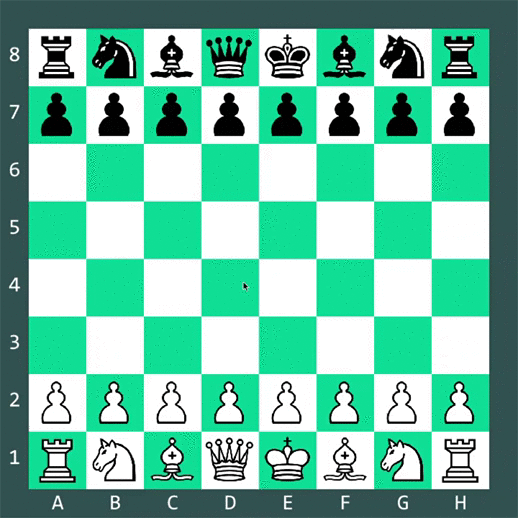

# Chess
Chess game I coded in python using pygame

## How to play
* It is a 2 player chess, so, you need 2 players.  
* Simply click the piece you want to move. All of the move options of that piece will be displayed. Choose any one of them or pick another piece.  
* For pawn promotion, just press the following keys on the keyboard and press Enter.  
  'q' - Queen  
  'r' - Rook  
  'b' - Bishop  
  'n' - Knight  

## Awesome Features 
* Added Castling special move.  
* Pawn promotion when it reaches the last square.  
* Options for pieces are limited when the king is in check to protect the king or move the king itself.    

## Features to be added 
* En Passant special move.  
* An AI to play against.  
* Restricting Castling for interupted path due to check.  
